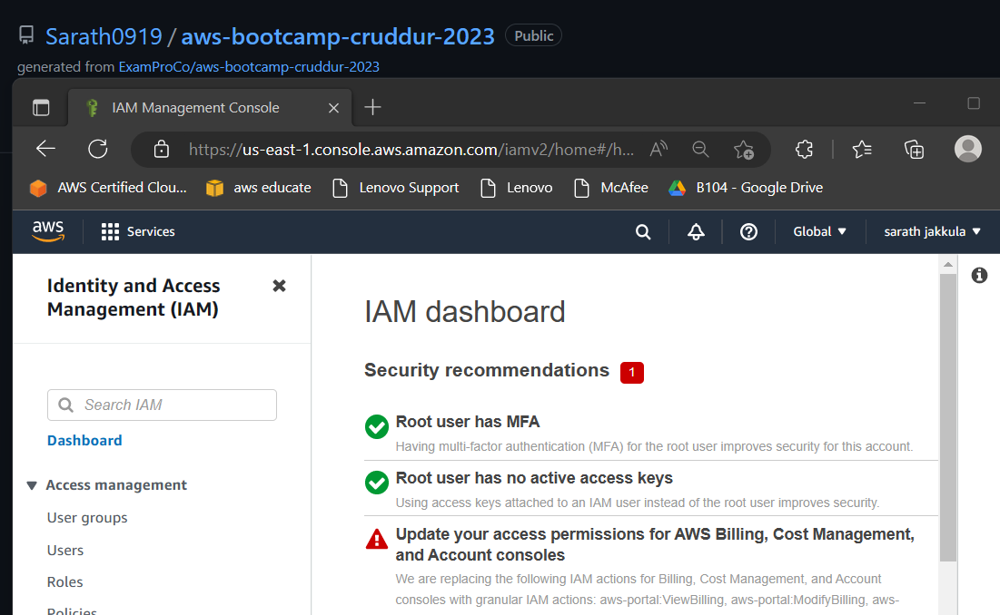
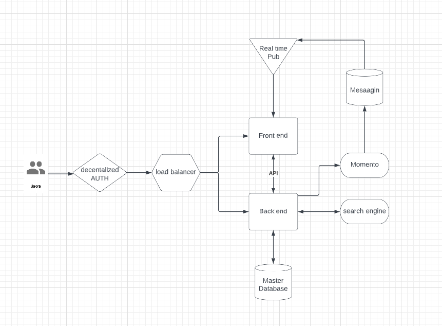
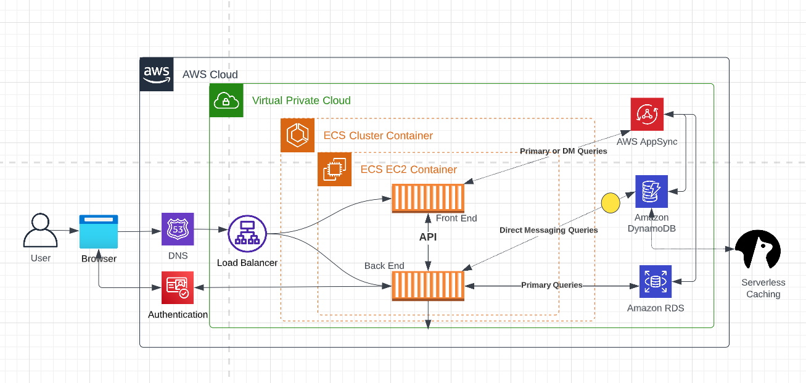
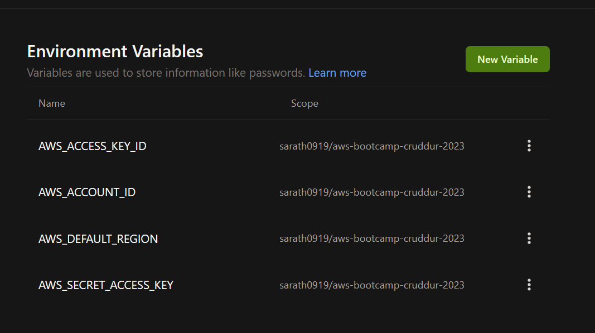
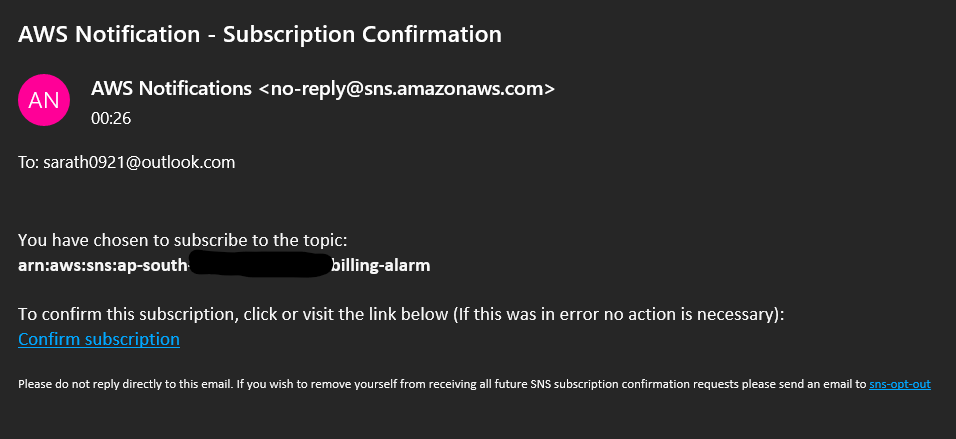

# Week 0 — Billing and Architecture


## Prerequisites
* Had AWS Account for Bootcamp which previously enabled MFA for both root and user accounts.
* Created Github repo using template.
* Created lucid charts account
* Set up Gitpod account authorized with Github.  Followed [Gifted Lane's Video](https://www.youtube.com/watch?v=yh9kz9Sh1T8) for setup, and [Andrew Brown's video](https://www.youtube.com/watch?v=A6_c-hJmehs) for the Gitpod button.


## Required Homework

1. Watched the recorded session as i missed the live.

2. Watched Chirag's Week 0 - Spend Considerations Video.

3. Watched Ashish's Week 0 - Security Considerations Video.
   * Activated MFA for root user.  
   

4.  Created Conceptual and logical Diagram in Lucid Charts
  
     * [Conceptual_cruddur](https://lucid.app/lucidchart/284b6512-334f-459c-8a56-8b89eebe7b6a/edit?viewport_loc=23%2C-167%2C2065%2C955%2C0_0&invitationId=inv_304939a4-4927-4b67-8ac2-ddc8f5e7125d).
       

     * [Logical_cruddr](https://lucid.app/lucidchart/a1e6d1c3-d545-43eb-887d-97bde9892bdb/edit?viewport_loc=-424%2C-254%2C1563%2C722%2C0_0&invitationId=inv_9e8d2c2c-c1e8-480b-b0e5-22e8301e0855)
       


5.  Installed AWS CLI for Gitpod using [this video](https://youtu.be/OdUnNuKylHg).  Manually installed, but also edited .gitpod.yml to auto-install if the environment gets restarted.

```
tasks:
  - name: aws-cli
    env:
      AWS_CLI_AUTO_PROMPT: on-partial
    init: |
      cd /workspace
      curl "https://awscli.amazonaws.com/awscli-exe-linux-x86_64.zip" -o "awscliv2.zip"
      unzip awscliv2.zip
      sudo ./aws/install
      cd $THEIA_WORKSPACE_ROOT
```

Confirmed in Gitpod [User Settings > Variables](https://gitpod.io/user/variables) that variables are saved:

    

Started up a new Gitpod environment to confirm AWS CLI was installed correctly and AWS credentials were pulled from Gitpod variables to environment variables.  Successfully ran ```aws sts get-caller-identity``` and returned values.


6.  Generated AWS Credentials - Access Key/Secret pair for cruddur-admin user.  Added persistent Gitpod variables to store AWS credentials for resuse using these commands:

```
gp env AWS_ACCESS_KEY_ID=""
gp env AWS_SECRET_ACCESS_KEY=""
gp env AWS_DEFAULT_REGION=""
```


10.  Created a Billing Alarm (after Budget)

   * [Used this document](https://docs.aws.amazon.com/AmazonCloudWatch/latest/monitoring/monitor_estimated_charges_with_cloudwatch.html) to set up a billing alarm using CloudWatch.
   * Also [read this blog](https://aws.amazon.com/blogs/mt/setting-up-an-amazon-cloudwatch-billing-alarm-to-proactively-monitor-estimated-charges/) to better understand how the services communicate with each other to send alerts.

   * Configured JSON file [here](../aws/json/aws-metric-alarm-config.json) with settings to breach alarm at $1 usage on one data point, and ran the following command in AWS CLI to set it up:

```
aws cloudwatch put-metric-alarm --cli-input-json file://aws-metric-alarm-config.json
```

This started to alarm almost right away, initially because of insufficient data, so I will wait to see if it addresses itself once data starts being tracked properly.

11.  Created a Budget

   * Used the JSON from [this article](https://awscli.amazonaws.com/v2/documentation/api/latest/reference/budgets/create-budget.html) to create a billing budget.  Stored a modified copy of it here.


  I configured the JSON files in the aws/json directory and ran the following command to create the budget:

  ```
  aws budgets create-budget \
    --account-id $AWS_ACCOUNT_ID \
    --budget file://aws-budget.json \
    --notifications-with-subscribers file://aws-budget-notifications-with-subscribers.json
  ```

   * Note that I have the AWS Account ID set as an environment variable in Gitpod so it can automatically be retrieved on workspace launch, rather than hardcoding.  I set this up in Gitpod via CLI using:
  
  ```
  gp env AWS_ACCOUNT_ID=""
  ```

  * I also created an SNS topic as a billing alarm, to email me if the usage exceeds 80% of $1.  I ran the following to create a Topic ARN, and once it was generated, ran the next command to subscribe SNS to the billing alarm and to notify me when in alarm:

  ```
  aws sns create-topic --name billing-alarm

  aws sns subscribe \
    --topic-arn="<billing-alarm-arn>" \
    --protocol=email \
    --notification-endpoint=emailaddress@gmail.com
```

   * I checked my email address, and confirmed the subscription so AWS will email me if the billing alarm goes off:

      

